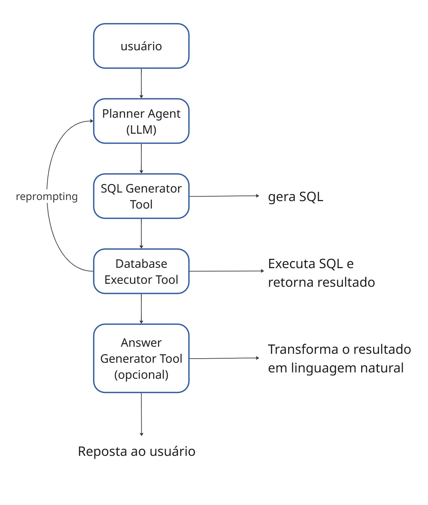

# Agente Industrial Inteligente: Text-to-SQL com Smolagents

Este repositório apresenta uma solução para o desafio de construir um agente inteligente capaz de interpretar perguntas em linguagem natural e convertê-las em consultas SQL, atuando sobre um banco de dados de manutenção industrial. O projeto utiliza a biblioteca `smolagents` da Hugging Face, orquestrando Large Language Models (LLMs) para facilitar a interação.

## Abordagem

Nossa abordagem se concentra na criação de uma arquitetura robusta capaz de entender a linguagem natural para gerar tanto consultas SQL simples quanto consultas mais complexas que envolvem junções de tabelas. O cerne da solução é um `CodeAgent` que interage com um banco de dados SQLite, onde o LLM atua como o cérebro, interpretando a pergunta, raciocinando sobre o esquema do banco de dados e gerando a consulta SQL correta.

Adicionalmente, para demonstrar a aplicabilidade e facilitar a interação, apresentamos um caderno Jupyter (`streamlit_prova.ipynb`) contendo uma interface amigável em Streamlit, permitindo que qualquer usuário interaja com o agente de forma intuitiva com um histórico da conversa durante a sessão.

### Diagrama de Arquitetura




#### Fluxo de Interação:

* Usuário: Inicia a interação com uma pergunta em linguagem natural.

* Planner Agent (LLM): O Large Language Model principal interpreta a pergunta do usuário, entende a intenção e planeja a série de ações necessárias para obter a resposta. Ele utiliza o esquema do banco de dados fornecido para auxiliar no planejamento.

* SQL Generator Tool: Com base no plano do LLM, esta ferramenta é acionada para gerar a consulta SQL apropriada. Esta etapa é crucial para traduzir a intenção do usuário para uma linguagem de banco de dados.

* Database Executor Tool: Esta ferramenta executa a consulta SQL gerada diretamente no banco de dados de manutenção industrial (SQLite). Ela é responsável por interagir com o banco de dados e obter os resultados brutos da consulta.

* Answer Generator Tool (Opcional): Se necessário, esta ferramenta (também utilizando um LLM) processa os resultados brutos do banco de dados e os transforma em uma resposta clara e concisa em linguagem natural, tornando-a mais compreensível para o usuário.

* Resposta ao Usuário: A resposta final é apresentada ao usuário.

### Como Executar o Código
Para executar o projeto, siga os passos abaixo:
O próprio notebook prueba_tecnica.ipynb lista as dependências necessárias. Você pode instalá-las usando pip:
```
!pip install smolagents python-dotenv sqlalchemy --upgrade -q
```

Token de Autenticação Hugging Face:
Para usar os modelos do Hugging Face, você precisará de um HF_TOKEN. É fortemente recomendado que você crie um arquivo .env na raiz do seu projeto para armazenar este token de forma segura, evitando expô-lo diretamente no código.

Crie um arquivo chamado .env e adicione a seguinte linha:
```
HF_TOKEN="SEU_TOKEN_AQUI"
```
Em seguida, no seu código (ou no notebook), carregue-o:
```
Python

from dotenv import load_dotenv
load_dotenv()
import os
os.environ["HF_TOKEN"] = os.getenv("HF_TOKEN")
```
Alternativamente, para testes rápidos, você pode inserir o token diretamente no notebook (não recomendado para produção):

```

os.environ["HF_TOKEN"] = "SEU_TOKEN_AQUI" # Substitua pelo seu token real

```
Download do Banco de Dados:
O notebook prueba_tecnica.ipynb já inclui o comando para baixar o banco de dados manutencao_industrial.db:

Python
```
!wget -O manutencao_industrial.db "[https://drive.google.com/uc?export=download&id=1B4l59bdPycqB4peRQxrrgOIlmGkGi-0v](https://drive.google.com/uc?export=download&id=1B4l59bdPycqB4peRQxrrgOIlmGkGi-0v)"
```
Executar o Notebook:
Abra e execute as células do prueba_tecnica.ipynb em um ambiente como Google Colab ou Jupyter Notebook.

### Exemplos de Perguntas Suportadas
O agente pode lidar tanto com perguntas predefinidas como com consultas autônomas em linguagem natural. Exemplos de perguntas que o agente pode responder incluem:

"Qual técnico trabalhou na ordem de manutenção número 32?"

"Quais são os tipos de equipamento que passaram por manutenção nos últimos 3 meses?"

"Qual é o técnico que trabalhou em mais ordens de manutenção?"

"Quantas ordens de manutenção foram realizadas neste ano?"

"Quais equipamentos precisam de manutenção preventiva?"

"Qual é a especialidade do técnico que mais trabalhou?"

"Em qual turno ocorrem mais manutenções?"

"Qual foi a última ordem de manutenção realizada?"

É possível empregar diferentes modelos de linguagem, alterando a linha model_id na classe IndustrialMaintenanceAgent. Atualmente, o modelo padrão é Qwen/Qwen2.5-Coder-32B-Instruct. Outras opções comentadas no código são microsoft/Phi-3.5-mini-instruct e Qwen/Qwen2-72B-Instruct. É importante notar que a complexidade das consultas que o agente conseguirá gerar estará diretamente relacionada à robustez e capacidade do LLM selecionado. Modelos mais avançados tendem a ser mais eficazes na interpretação e geração de SQL complexo, incluindo junções e agregações.

### Limitações e Sugestões de Melhoria
# Limitações
* Capacidade do Modelo: A complexidade das consultas SQL que o agente pode gerar depende diretamente da capacidade do LLM utilizado. Embora os modelos selecionados (como Qwen/Qwen2.5-Coder-32B-Instruct) sejam capazes de criar perguntas que envolvem JOIN de tabelas (como visto nos exemplos), modelos menores podem ter dificuldades com consultas mais complexas.

* Nome da Tabela: Como observado nas execuções, o LLM pode, ocasionalmente, inferir nomes de tabelas ligeiramente diferentes dos reais (ordens_de_manutencao em vez de ordens_manutencao). Isso requer uma verificação e possível refinamento do prompt para guiar o modelo a usar os nomes exatos.

* Dependência da API e Gratuidade: A utilização de modelos externos via InferenceClientModel depende da disponibilidade e das políticas de uso gratuito das APIs do Hugging Face ou de outros provedores. Consultas excessivas podem incorrer em custos ou limitações de taxa.

* Janela de Iterações (max_steps): A capacidade de o agente resolver uma consulta está limitada pelo parâmetro max_steps. Consultas que exigem um raciocínio mais aprofundado ou múltiplas tentativas para chegar à resposta correta podem falhar se o número máximo de passos for atingido.


# Sugestões de Melhoria
* Modelos Mais Complexos: Experimentar modelos LLMs mais avançados e específicos para geração de código ou Text-to-SQL pode melhorar significativamente a precisão e a capacidade de lidar com consultas ainda mais complexas.

* Implementação de Memória: Integrar um mecanismo de memória de contexto ao agente. Isso permitiria que o agente mantivesse o histórico da conversa, tornando as interações mais fluidas e permitindo perguntas sequenciais contextuais.

* Segurança no Prompting: Implementar validações e filtros no prompt para prevenir ataques de injeção de SQL ou tentativas maliciosas de apagar/modificar dados através do agente. Isso é crucial para garantir a segurança do banco de dados em um ambiente de produção.

* Melhorias na Interface Streamlit: A interface apresentada em streamlit_prova.ipynb pode ser expandida para oferecer funcionalidades adicionais para feedback ou correção do usuário

* Testes Automatizados: Desenvolver um conjunto robusto de testes automatizados para validar a precisão das consultas SQL geradas e as respostas do agente, especialmente para cenários complexos de junção de tabelas e agregações.

* Otimização do Prompt: Refinar o prompt fornecido ao LLM, incluindo exemplos de "few-shot learning" ou diretrizes mais específicas sobre os nomes das tabelas e colunas, para melhorar a acurácia na geração do SQL.

*Desacoplamento de Credenciais: Reforçar a prática de carregar tokens de arquivos .env para segurança e portabilidade.
